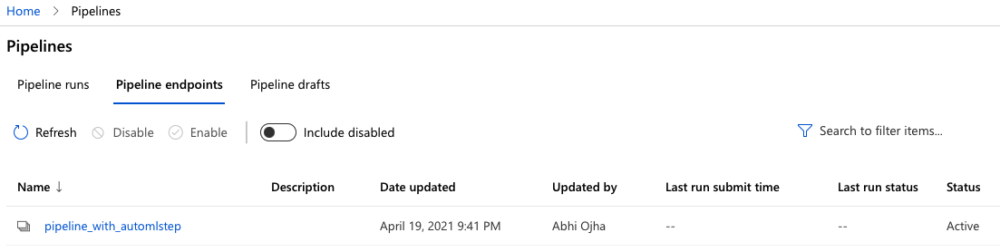

# Operationalizing Machine Learning

## Overview

I created and deployed a Machine Learning model in this project, first using Azure ML Studio and then using Azure Python SDK. I used Swagger UI to interact with the REST API resources of the deployed model.

The dataset used for training the model contained data about the marketing campaigns of a banking institution. My goal was to predict whether the client will subscribe to the bank or not.

## Architectural Diagram

In this project, we followed the following steps:

1. Automated ML experiment
2. Deploy the best Model
3. Enable logging
4. Swagger Documentation
5. Consume Model endpoints
6. Create and publish a pipeline
7. Documentation

## Key Steps and Screenshots
1. **Automated ML Experiment**: This step involves creating an experiment using Automated ML, configuring a compute cluster, and using that cluster to run the experiment.

   

   *Fig. 1: Registered dataset*

   ---

   

   *Fig 2: A complete run from the AutoML experiment*

   ---

   

   *Fig 3: Top 5 AutoML models*

   ---

   

   *Fig 4: Best AutoML Model Metrics*

   ---

2. **Deploy the Best Model**: Based on the accuracy and AUC values, I decided the best model (it is at the top of the *Models* tab in Azure). I deployed the best model using Azure Container Instance (ACI).

3. **Logging**: In this step, we enabled *Application Insights* and retrieved logs.

   

   *FIg 5: Image showing that Applications Insights is enabled*

   ---

   

   *Fig 6: Output of logs.py*

   ---

4. **Swagger Documentation** - "Swagger" is an open-source tool that helps design, build, document, and consume REST APIs. In this project, we have used a tool called *Swagger UI* for generating interactive API documentation. Using Swagger UI, a user can try out API calls directly in the browser.

   Azure creates a `swagger.json` file for all the deployed models. I used this JSON file to consume the deployed model using Swagger. To that end, I executed the shell script `swagger.sh`, which starts the swagger docker container. Next, I created a Python server on Port 8000 using `serve.py`.

   

   *Fig 7: Running Python server on Port 8000*

   ---

   Finally, I opened the [Swagger-UI tool](https://swagger.io/tools/swagger-ui/) and clicked on `Live Demo` to interact with the deployed model's API. Below are some screenshots taken from the Swagger-UI tool.

   

   *Fig 8: Swagger UI - Live Explore*

   ---

   

   *Fig 9: Swagger UI - GET Method*

   ---

   

   *Fig 10: Swagger UI - POST Method*

5. **Consume Model Endpoints**: After deploying the best model, I consumed its REST API endpoint using `endpoint.py` after modifying the `scoring_uri` and `key` values to match what appears in the Consume tab of the endpoint.

   

   *Fig 11: Output of endpoint.py*

6. **Create, Publish and Consume a Pipeline**: In this step, I used the `aml-pipelines-with-automated-machine-learning-step.ipynb ` notebook to create, publish and cosume a pipeline using the Azure Python SDK.

   

   *Fig 12: Created a pipeline*

   ---

   

   *Fig 13: Pipeline Run Complete*

   ---

   

   *Fig 14: Created pipeline endpoint*

   ---

   

   *Fig 15: Image showing the Active status of Pipeline Endpoint and the created swagger.json file*

   ---

   

   *Fig 16: Output of the RunDetails Widget in the Jupyter Notebook*

## Areas of Improvement

* Tackle class imbalance by oversampling of minority class
* Try other custom algorithms
* Run AutoML for a longer time to get better results.

## Screen Recording

https://youtu.be/srqP9J4dv0k

